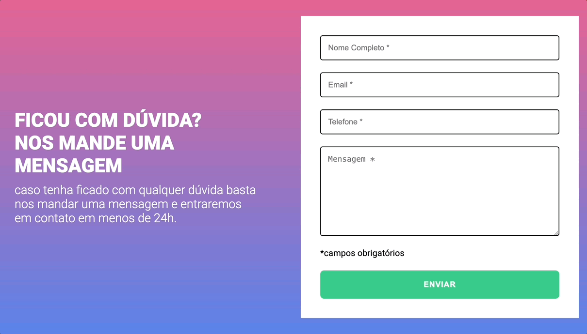

# Formulário com Validação

Projeto criado como forma de avaliação no curso DevQuest. 👾

## Requisitos

- Ao clicar para enviar o formulário, se caso
algum campo não estiver preenchido, a borda
do input deve ficar vermelha e uma mensagem
de "campo obrigatório" deve aparecer embaixo
do campo que não foi preenchido

- Se um campo estiver preenchido, a borda
do input deve ficar verde e a mensagem de "campo
obrigatório" deve desaparecer

- A validação do formulário deve ser feita com
javascript puro

## Tecnologias utilizadas

- HTML

- CSS

- JavaScript

## Aprendizado

- Aprendi a manipular o evento de clique, de modo que seja possível fechar todos os outros itens ao clicar em uma pergunta

## Preview do site

